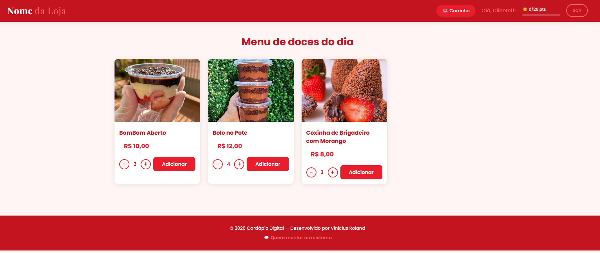
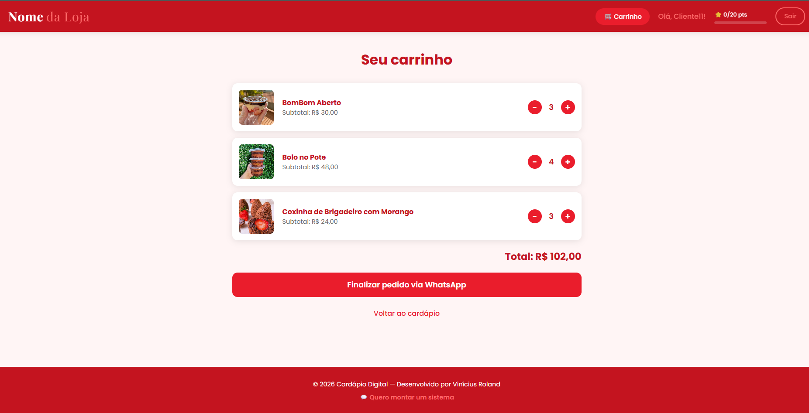

# Cardápio Digital

Aplicação web para confeitarias feita em Django. O cliente navega pelo catálogo,
monta o carrinho e finaliza o pedido diretamente pelo WhatsApp.

## Funcionalidades

- Catálogo de produtos com imagens e preços
- Carrinho de compras persistido por sessão
- Controle de quantidade por produto
- Cadastro e login com perfil do cliente
- Sistema de pontos de fidelidade
- Finalização de pedido via WhatsApp com `urllib.parse`
- Formatação de preços no padrão brasileiro

## Stack

Python · Django · SQLite · HTML · CSS

## Como rodar

git clone https://github.com/viniciusroland01/cardapio-digital.git
cd cardapio-digital

python -m venv venv
venv\Scripts\activate

pip install django pillow

python manage.py migrate
python manage.py createsuperuser
python manage.py runserver

Acesse http://127.0.0.1:8000 para o cardápio e /admin para cadastrar produtos.
